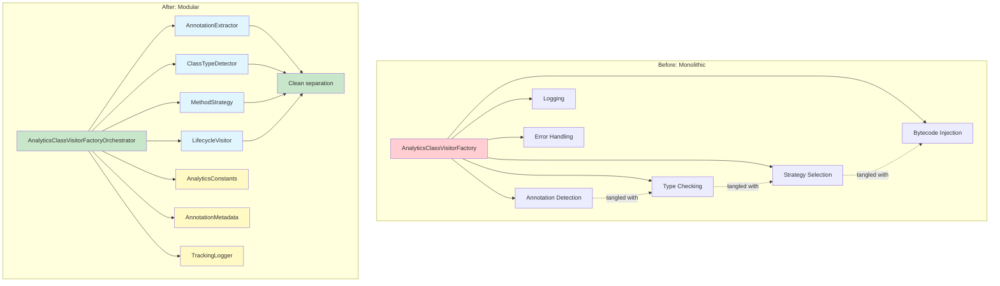
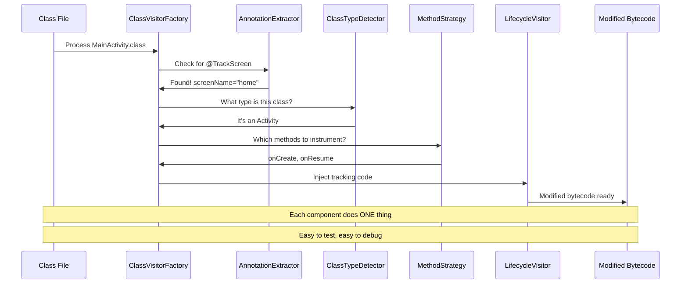
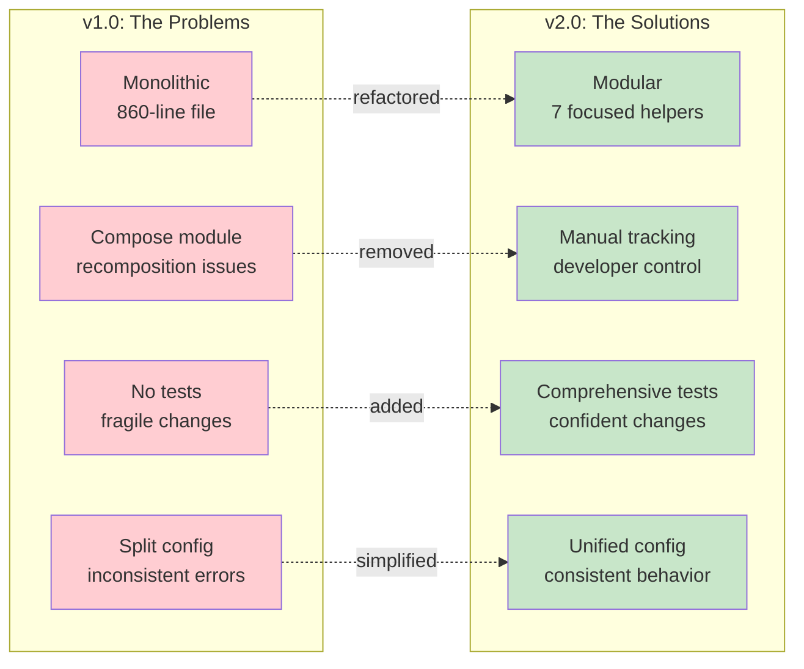

I spent three days debugging a bug I found in 20 minutes.

The bug was simple: Fragment tracking wasn't firing correctly in ViewPagers. The fix was obvious once I located it—a timing issue with bytecode injection. But between finding it and feeling confident enough to fix it? Three days of reading through a monolithic file where everything depended on everything else.

That file was the core of our analytics library. It did everything: scanned for annotations, detected class types, chose instrumentation strategies, injected bytecode, logged debug info, handled errors. All in one tangled mess. Touch one section, verify five others don't break.

This is the story of version 2.0.0, where we deleted an entire module, refactored that monster file, and shipped a library with fewer features but better architecture. Turns out, sometimes progress looks like deletion.

## The Compose Problem We Couldn't Solve

Supporting Jetpack Compose in v1.0 felt mandatory. We added `@TrackScreenComposable` annotations and tracking composables. It shipped. Users used it. And it didn't work right.

The problem was recomposition. Compose functions can execute dozens of times per second as state changes. Your screen renders once, but the composable describing it might run 50 times. If you track every execution, you flood analytics with duplicates. One screen view becomes hundreds of events.

We tried to be smart. We used `LaunchedEffect(Unit)` to track only once. We added `TrackScreenOnce` for explicit control. We documented when to use which approach. But here's what we learned: there's no universal answer to "when should a Compose screen be tracked?"

Different apps need different things:
- Some want tracking only on initial composition
- Some want tracking when specific state changes
- Some want tracking on back navigation
- Some want tracking every time (for debugging)

By providing `@TrackScreenComposable`, we were making that decision for developers. Whatever we chose was wrong for someone. The annotation implied "we know when to track," but we didn't. Only the developer knows their navigation patterns and tracking needs.

Version 2.0.0 removes the entire Compose module. Instead, developers use the `@Trackable` and `@Track` annotations with full control over when tracking fires:

```kotlin
@Composable
fun ProductCard(productId: String, productName: String) {
    // Developer controls WHEN tracking fires
    LaunchedEffect(productId) {  // Tracks when productId changes
        ScreenTracking.getManager().logEvent(
            "product_card_displayed",
            mapOf(
                "product_id" to productId,
                "product_name" to productName,
                "display_context" to "card"
            )
        )
    }
    
    Card {
        Text(productName)
        Button(onClick = { 
            // Or track on user interaction
            ComposableScreenTracker.handleProductClick(productId)
        }) {
            Text("View Product")
        }
    }
}
```

More verbose? Yes. But explicit about *when* tracking happens. The developer sees `LaunchedEffect(productId)` and knows tracking fires when `productId` changes. They see `LaunchedEffect(Unit)` and knows it tracks once. They can use `DisposableEffect`, `rememberCoroutineScope`, or whatever fits their needs.

The annotation version hid this decision. It pretended to know when tracking should happen, but it couldn't. Recomposition timing is an app concern, not an analytics concern. Version 2.0.0 stops pretending otherwise.

## The Refactoring That Fixed Everything

After that three-day debugging session, I made a decision: split the monolithic file into pieces. Every time I scrolled past unrelated code to find what I needed, I extracted it.

Annotation parsing kept getting in the way? Extract it.  
Class type detection scattered everywhere? Consolidate it.  
Constants repeated throughout? Gather them.

We ended up with seven focused helpers, each answering one question:
- Is this an Activity or Fragment?
- What parameters did the annotation specify?
- Which lifecycle method should we instrument?

The complexity didn't disappear—it got isolated. Before, fixing that Fragment bug meant navigating through this mess where everything was tangled together. After:

```kotlin
val classType = ClassTypeDetector.detect(className, superName)
val strategy = MethodInstrumentationStrategy.select(classType, methodName)

if (strategy.shouldInstrument) {
    return LifecycleInstrumentingMethodVisitor(metadata, strategy)
}
```

Same functionality. But when something breaks now, the error message tells you which focused helper failed. You open a 50-line file that does one thing, not an 860-line file that does everything.

### The Architecture Transformation

Here's what the refactoring looks like visually:



Each helper has clear inputs and outputs. When a test fails, you know exactly which component broke. When you need to add a feature, you know which file to modify.

And testing became trivial. Before, testing meant mocking ASM's entire API. After, testing type detection meant calling a function with two strings. No mocking required.

## One Error Handler, Not Three

Here's a small change that reveals a larger pattern. The old version configured error handling separately for each feature:

```kotlin
ScreenTracking.initialize(app) { /* config */ }
MethodTracking.configure { errorHandler = { ... } }
```

Version 2.0.0 centralizes it:

```kotlin
ScreenTracking.initialize(
    config =
        analyticsConfig {
            debugMode = true
            providers.add(InMemoryDebugAnalyticsProvider())
            errorHandler = { throwable ->
                Log.e("Analytics", "Method tracking error", throwable)
            }
        },
)
```

One configuration point. One error handler. Consistent behavior across all operations. 

This is technically *less* powerful—you can't have different handlers anymore. But that limitation is also a simplification. Fewer knobs means fewer ways to misconfigure things.

### How the Plugin Actually Works

For those curious about the execution flow, here's how the plugin processes a class with `@TrackScreen`:



The beauty is in the separation. Each arrow represents a clear responsibility boundary. When something breaks, the sequence diagram tells you exactly where to look.

## What Changed

Version 2.0.0 ships with:

**Compose module removed.** If you used `@TrackScreenComposable`, call the analytics manager directly. This breaks code, but it's honest about what the library can and can't do well.

**Refactored architecture.** The monolithic instrumentation file split into focused helpers. Each does one thing. Each is testable. Each makes sense when you read it.

**Comprehensive tests.** Both instrumented tests (running on real Android) and unit tests (for helper logic). The plugin now has guardrails.

**Simplified configuration.** Removed redundant properties. The presence of `@TrackScreen` is sufficient. Less configuration, clearer behavior.

## What This Means

If you're using Activities and Fragments, upgrade to v2.0 with zero code changes. You get better error handling, test coverage, and the stability that comes from focused architecture.

If you're using Compose tracking, you have options: call tracked methods with `@Trackable` and `@Track` (recommended), migrate to Activities/Fragments, or stay on v1.0 until you're ready.

The broader lesson: software grows by addition, but at some point you have to prune. Not because users demanded it, but because maintenance burden compounds. Every feature is a commitment to test, document, and support it. If it's not pulling its weight, remove it.

This feels wrong. We're trained to think progress means more features, more capabilities. But look at what we did: removed Compose support, simplified configuration, focused on one thing. The library is objectively better. More maintainable. More reliable. More honest about its scope.

## What's Next

Removing Compose support in v2.0 doesn't mean abandoning Compose forever. It means doing it right.

**Kotlin Compiler Plugin:** We're planning to migrate from Gradle Transform API to the Kotlin compiler plugin. This will give us better integration with Kotlin's compilation pipeline, better error messages, and more precise control over code generation. It's also the modern approach—the Android ecosystem is moving away from bytecode transformation for many use cases.

**Compose Multiplatform Support:** Once we have the compiler plugin foundation, we can properly support Compose Multiplatform (CMP). Not just Android Compose, but iOS, desktop, and web. The `@Trackable` and `@Track` pattern already works across platforms. With a compiler plugin, we can make Compose screen tracking work correctly across all of them—without the recomposition problems that plagued v1.0.

Here's the difference: v1.0 tried to support Compose by bolting it onto bytecode transformation. It didn't fit. The future version will be designed for Compose from the ground up, with full awareness of recomposition, multiplatform concerns, and developer control.

Removing the feature now gives us space to build it properly later. Sometimes you need to tear down before you can rebuild.

I started this article talking about three days of debugging. The truth is, I wasn't just debugging code. I was avoiding a decision: admit Compose wasn't working, refactor the architecture, ship a breaking change. Once I stopped avoiding it, the path forward was obvious.

Version 2.0.0 isn't perfect. But it's focused. It does automatic screen tracking for Activities and Fragments, and it does it well. When bugs appear, I know where to look. When features need adding, I know which helper to modify.

That's what less gives you: clarity.

### The Transformation at a Glance



## Your Turn

You probably have a monolithic file that nobody wants to touch. The file that works but breaks in unpredictable ways. Start by naming the actual problem—not "this is messy" but specifically what's tangled together.

Then extract one piece. Pick the clearest boundary. Make it work. Test it. Ship it.

Then do it again.

Write tests before you think you need them. Tests are scaffolding, not documentation. They clarify what the code should do, which reveals how to restructure it.

And sometimes, the best feature you can ship is the one you remove.

What are you going to extract first?

---

*Full release notes for [Easy-Analytics v2.0.0](https://github.com/sh3lan93/analytics-annotation/releases/tag/v2.0.0) are on GitHub. Migration questions? Open an issue—we're here to help.*